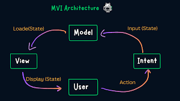
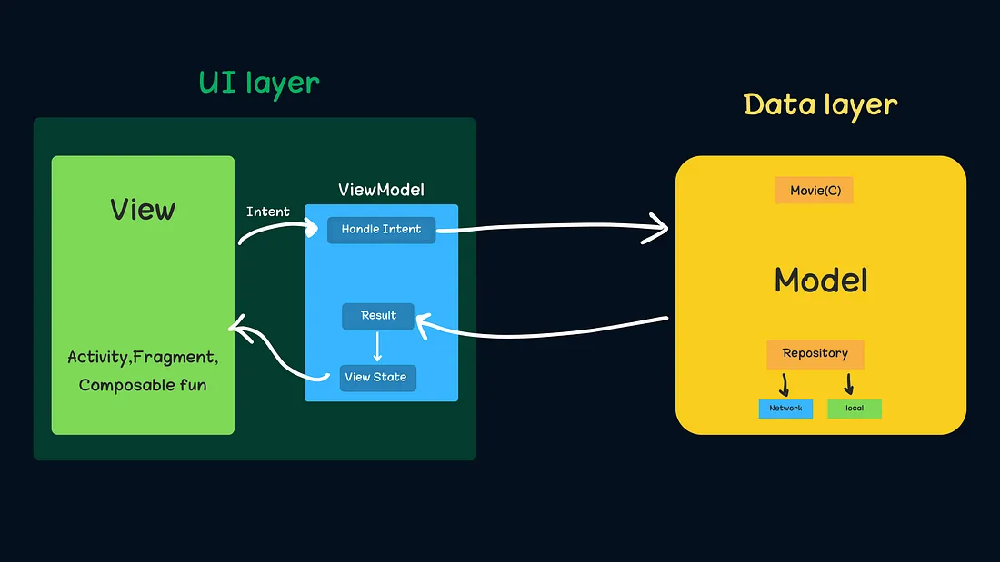

# MVI Architecture with Jetpack Compose and Ktor

## MVI Work Flow

## MVI Data layers

This Android project demonstrates the MVI (Model-View-Intent) architecture using Jetpack Compose for the UI, Ktor for networking, and Kotlin Coroutines for asynchronous operations. It fetches a list of posts from a REST API and allows navigation to a next screen via an App Bar button.

## MVI Explained

MVI is a unidirectional architectural pattern that separates concerns into three components: Model, View, and Intent. Here’s what each means:

### M - Model
The **Model** represents the state of the application—data and UI states that the View renders. It’s the single source of truth, managed by the ViewModel, and updated based on user intents. In this project:
- Defines the app’s data (e.g., posts) and UI states (e.g., loading, error).
- Immutable state objects ensure predictable updates.

**Code Files Under Model:**
- `MVI_States/PostState.kt`: Defines `PostState` (sealed class) for UI states like `Loading`, `Posts`, and `Error`, representing post-related data and conditions.
- `MVI_States/NavigationEvent.kt`: Defines `NavigationEvent` (sealed class) for navigation actions, decoupling navigation from post states.
- `model/Post.kt`: Defines the `Post` data class, representing the structure of API response data.

### V - View
The **View** is the UI layer that displays the Model’s state and captures user interactions, sending them as intents to the ViewModel. In this project:
- Renders UI based on `PostState` and `Clickable` states using Jetpack Compose.
- Handles navigation via `NavController` triggered by `NavigationEvent`.

**Code Files Under View:**
- `ui/screens/PostScreen.kt`: Implements `PostScreen` (composable) to display posts, a toggle button, and an App Bar with a navigation button; includes `NextScreen` and `NavigationSetup`.
- `MainActivity.kt`: Sets up the app entry point, hosting the `NavigationSetup` composable within a theme.
- `ui/theme/Theme.kt`: Defines `MyAppTheme` for consistent UI styling across composables.

### I - Intent
The **Intent** represents user actions or events that intend to change the application state. These are sent from the View to the ViewModel, which processes them to update the Model.
- Encapsulates user interactions (e.g., load posts, toggle clickable, navigate).
- Drives the unidirectional flow: Intent → Model → View.

**Code Files Under Intent:**
- `ui/PostIntent.kt`: Defines `PostIntent` (sealed class) with actions like `LoadPosts`, `ToggleClickable`, and `NavigateToNextScreen`.

## Project Structure
- **Model Files**: Define and manage state and data (`PostState.kt`, `Clickable.kt`, `NavigationEvent.kt`, `Post.kt`).
- **View Files**: Render UI and handle navigation (`PostScreen.kt`, `MainActivity.kt`, `Theme.kt`).
- **Intent Files**: Capture user actions (`PostIntent.kt`).
- **ViewModel**: `ui/PostViewModel.kt` orchestrates intents, updates states, and manages navigation events using Ktor (`ApiService`).
- **Networking**: `network/ApiService.kt` (interface) and `network/KtorApiService.kt` (implementation) fetch posts from the API.

## How It Works
1. **User Action**: Clicking the App Bar button sends `NavigateToNextScreen` intent.
2. **ViewModel**: Processes the intent, sends a `NavigationEvent` via a `Channel`.
3. **View**: Collects the event and navigates using `NavController`, rendering states like post lists or errors.

## Dependencies
- Jetpack Compose for UI.
- Ktor for networking.
- Kotlin Coroutines for async operations.
- Jetpack Navigation for screen transitions.

## Running the Project
1. Ensure `INTERNET` permission is in `AndroidManifest.xml`.
2. Sync Gradle with dependencies.
3. Run on an emulator or device with internet access.
